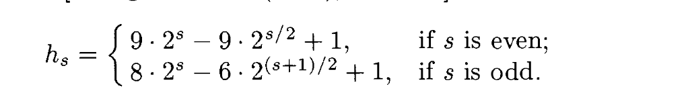

# 希尔排序





```c
#include <stdio.h>
#include <stdlib.h>
#include <time.h>
#include <math.h>

int arr[MAXN];　//因为数组可能很大，所以声明为全局变量

void shell(int arr[], int n)
{
    int t1 = ceil(2 * (log(1 + sqrt(1 + 4 * (n - 3) * 0.1 / 27)) / log(2)) - 2);
    int t2 = ceil(2 * (log(3 + sqrt(9 + 4 * (n - 3) * 0.1 / 3)) / log(2)) - 5);
    t1 = (t1 % 2 == 0) ? (t1 - 2) : (t1 - 1);
    t2 = (t2 % 2 != 0) ? (t2 - 2) : (t2 - 1);
    int t = (t1 > t2) ? t1 : t2;
    if (t < 0)
        t = 0;
    printf("t1=%d,t2=%d,t=%d\n", t1, t2, t);

    int gap;
    for (int i = t; i >= 0; i--) {
        if (i % 2 == 0)
           gap = 9 * ((2 << i) - (2 << (i >> 1))) + 1;
        else
           gap = (2 << (i + 3)) - 6 * (2 << ((i + 1) >> 1)) + 1;

        for (int j = gap; j < n; j++) {
            int k = j - gap, key = arr[j];
            while (k >= 0 && key < arr[k]) {
                arr[k + gap] = arr[k];
                k = k - gap;
            }
            arr[k + gap] = key;
        } 
    }
}

int main()
{
    srand(time(NULL));
    for (int i = 0; i < MAXN; i++) {
        arr[i] = rand() % 1000000;
        printf("%d ", arr[i]);
    }
    printf("\n");

    shell(arr, MAXN);

    for (int i = 0; i < MAXN; i++) {
        printf("%d ", arr[i]);
    }
    printf("\n");

    return 0;
}
```



用命令`gcc shell.c -lm -D MAXN=1000000` 编译，其中1000000表示数组大小，可以换成其他数字。

### 代码解读

希尔排序的主要思想就不说了，可以到[wik](https://zh.wikipedia.org/zh-hans/%E5%B8%8C%E5%B0%94%E6%8E%92%E5%BA%8F)或TAOCP 第三卷（第二版的Algorithm D，英文版84页\)，代码中的t的引用也是对应TAOCP中求步进值的下标t（英文版93页）。这里面用的步进值是Sedgewick（N最好大于1000，不然用Knuth提出的步进值较好）提出的步进值（英文版93页）： 



步进值的取值从０到ｔ，而ｔ是使得 $$3h_t < N$$ 的最大的ｔ值，解得ｔ的取值为：

$$
t = max \lbrace\ 0, \lceil{2 * \log_2(1+\sqrt {1+ \frac {4*(N-3)}{27}} \ )-2}\rceil,\ \lceil{2*\log_2{(3+\sqrt{9+\frac{4*(N-3)}{3}}\ )}} - 5\rceil\ \rbrace
$$

然后，外循环从ｔ迭代到０结束。

